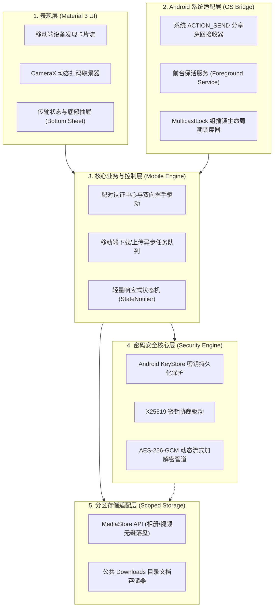

# 《基于混合加密与零配置协议的跨平台安全快传系统》
## 模块设计计划案：Android 移动端 (APK)

---

### 一、 终端定位与课题概述

* **课题全称**：基于混合加密与零配置协议的跨平台安全快传系统设计与实现
* **终端定位**：移动便携端（Mobile Client）。承担便携设备随行文件互传、利用摄像头毫秒级扫码建立带外信任锚点、系统级一键分享投送以及移动后台防杀保活传输。
* **交付形式**：独立安装包 `SafeDrop-release.apk`（体积 < 20MB，支持 Android 8.0 ~ Android 14+）。
* **设计原则**：
  1. **低功耗与稳定性**：合理调度网络锁与后台服务，防止传输中途被 Android 系统机制强杀。
  2. **轻态化 Material 3 设计**：现代圆角与动态取色卡片，针对单手手势优化。
  3. **沙箱合规**：全面适配 Android 10+ Scoped Storage（分区存储）规范，杜绝野蛮申请全盘管理权限。

---

### 二、 Android 端架构设计与解耦模型

采用响应式单向数据流与适配器模型，将 Android 原生复杂生命周期与核心业务完全隔离：



---

### 三、 核心功能与 Android 特色技术实现

#### 1. 突破省电限制：MulticastLock（组播锁）调度
* **问题背景**：Android 系统为延长续航，在 Wi-Fi 芯片底层默认丢弃未明确申请接收的 UDP 组播/广播报文，导致移动端无法接收 PC 的 mDNS 广播。
* **技术实现**：
  * 在进入 App 扫描界面或开启后台服务时，通过 `WifiManager.createMulticastLock("SafeDrop_Lock")` 显式持有锁；
  * 退出发现页或屏幕熄灭闲置时自动释放，平衡设备续航与通信实时性。

#### 2. CameraX 扫码与带外信任建立（Out-of-Band Pairing）
* **实现逻辑**：
  * 集成 Google ML Kit 视觉条码扫描器，调用手机摄像头解析 PC 屏幕展示的动态二维码；
  * 二维码格式定义：`safedrop://pair?ip=192.168.1.100&port=8899&fp=a3f8b9&token=x91k2d`；
  * 扫码成功后直接绕过 mDNS 广播阶段，向该 IP 发起单播握手，同时将指纹与 Token 发送给 PC 端完成防中间人身份比对。

#### 3. Android 10+ 分区存储（Scoped Storage）精细化适配
* **技术合规**：
  * **媒体类型（图片/视频/音频）**：解密完成后通过 `ContentResolver` 与 `MediaStore.Images.Media.EXTERNAL_CONTENT_URI` 写入，手机相册立即刷新显示。
  * **非媒体文档（ZIP/PDF/APK）**：通过 `MediaStore.Downloads` 写入系统下载目录。
  * **免申请危险权限**：无需向用户索取容易被拒的 `MANAGE_EXTERNAL_STORAGE`（所有文件访问权限），大幅提高安装使用率。

#### 4. 前台服务（Foreground Service）与动态通知栏联动
* **抗系统杀进程机制**：
  * 传输触发时，拉起绑定系统前台通知的 `ForegroundService`；
  * 通知栏动态渲染进度条：显示当前文件名、已传输百分比、即时传输速率（MB/s）及“取消传输”Action 操作按钮；
  * 传输完成自动转为普通通知并触发轻量触感震动反馈。

#### 5. 系统级一键分享集成（System Share Sheet）
* **实现逻辑**：
  * 在 `AndroidManifest.xml` 中为核心 Activity 注册 `<intent-filter>`，拦截 `android.intent.action.SEND` 与 `SEND_MULTIPLE`；
  * 用户在微信、相册、文件管理器中选中任意文件点击“系统分享”，在弹出的应用列表选择“SafeDrop”，一键启动投送界面并加载局域网在线电脑。

---

### 四、 接口契约与数据流定义

#### 1. 移动端作为客户端的发起流程
* **步骤 1（探活）**：向 PC 端 `GET /api/v1/ping` 确认通信通道通畅。
* **步骤 2（协商）**：向 PC 端 `POST /api/v1/handshake/init`，携带 Android 端临时 X25519 公钥与客户端随机 Nonce。
* **步骤 3（推送/接收）**：基于协商出的密钥分块推流，实时更新前台通知栏进度。

#### 2. Android 本地安全凭据存储
* 利用 **Android Keystore** 对本机的长期身份私钥进行硬件级保护，敏感设备白名单采用 SQLCipher 或 EncryptedSharedPreferences 本地加密存储。

---

### 五、 技术栈选型与工程目录规划

#### 1. 推荐技术栈
* **开发框架**：**Flutter (Android 原生构建)** 或 **Android 原生 (Kotlin + Jetpack Compose)**。
* **推荐方案**：采用 **Flutter**，加解密引擎与协议状态机可与 Windows 端实现 80%+ 的代码直接复用，同时借助 Platform Channel 优雅调用 Android 原生 `WifiManager` 与 `ForegroundService`。

#### 2. 工程目录结构规范
```text
android/
├── android/                 # Android 原生 Gradle 工程、Manifest 与 Native Services
│   └── app/src/main/
│       ├── AndroidManifest.xml
│       └── kotlin/.../
│           ├── MulticastLockHelper.kt   # 组播锁原生实现
│           └── TransferForegroundService.kt # 前台通知服务
└── lib/
    ├── app/                 # 移动端主题、路由、全局国际化
    ├── core/                # 与 Windows 完全共享的核心算法库
    │   ├── crypto/          # X25519, AES-256-GCM, SHA-256
    │   ├── network/         # 传输流封装、mDNS 监听
    │   └── storage/         # Scoped Storage 适配器
    ├── features/            # 移动端业务实现
    │   ├── scanner/         # CameraX 扫码与解析模块
    │   ├── discovery/       # 移动端设备雷达列表
    │   ├── receiver/        # 接收监听与通知栏控制
    │   └── share_intent/    # 系统一键分享响应处理
    └── presentation/        # Material 3 页面
        ├── pages/           # 首页、扫码页、传输历史页
        └── widgets/         # 移动端水波纹雷达、传输卡片
```

---

### 六、 开发实施计划与进度里程碑

| 阶段 | 周期 | 核心开发任务 | 交付标志 |
| :--- | :--- | :--- | :--- |
| **阶段一：移动端基建** | 1~2 周 | 搭建 Android 编译工程，配置 Material 3 动态取色主题，实现动态权限申请流（相机/通知/Wi-Fi）。 | 可正常运行的移动端基础骨架 |
| **阶段二：硬件与系统适配** | 3~4 周 | 接入 CameraX / ML Kit 扫码、实现 MulticastLock 组播锁持有逻辑与后台前台服务。 | 具备扫码与局域网收包能力的测试包 |
| **阶段三：存储沙箱与加解密** | 5~6 周 | 适配 MediaStore 分区存储接口，集成 X25519 密钥协商与 AES-GCM 流式解密落盘。 | 能够解密接收 Windows 发来的单个测试文件 |
| **阶段四：跨端联调与分享** | 7~8 周 | 集成系统分享菜单（ACTION_SEND），与 Windows 端开展双向 GB 级文件传输与断网恢复测试。 | 双端互传与分享功能全面稳定 |
| **阶段五：性能优化与答辩** | 9~10 周 | 针对不同品牌 Android 手机开展机型适配与耗电优化，构建正式 Release APK 并撰写毕业论文。 | 最终安装包（APK）与完整毕业论文初稿 |

---

### 七、 毕业设计论文核心论述与答辩要点

1. **移动端近场发现与能耗平衡策略**：
   * 详细论述为什么移动端需要 `MulticastLock`，分析开启网络锁对设备续航的影响，并给出按需加锁/退后台自动释放的节电策略数据。
2. **Android 现代存储架构（Scoped Storage）与安全隔离**：
   * 论述从早期滥用 `SDCard` 读写权限到现代分区存储的发展历程，阐明系统如何在不索要越权敏感权限的前提下优雅将数据写入系统相册/下载目录。
3. **前台服务对长连接与流传输的保活机制**：
   * 深入剖析 Android 后台进程回收机制（Low Memory Killer 与 Doze 模式），论述通过 Foreground Service + Notification 保持网络 Socket 管道不中断的设计原理。
