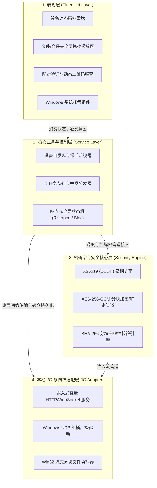

# 《基于混合加密与零配置协议的跨平台安全快传系统》
## 模块设计计划案：Windows 图形化桌面客户端 (PC 端)

---

### 一、 终端定位与课题概述

* **课题全称**：基于混合加密与零配置协议的跨平台安全快传系统设计与实现
* **终端定位**：桌面中枢端（Desktop Hub）。作为大文件吞吐中心、局域网设备拓扑雷达大屏展示、离线信任二维码生成源以及常驻后台的安全守护进程。
* **交付形式**：单文件绿色免安装版 `.exe`（双击即用、无运行库环境依赖、内存常驻 < 40MB）。
* **设计原则**：
  1. **代码完全解耦**：UI 表现层与核心传输/加解密引擎解耦，方便后期独立重构或替换底层库。
  2. **极简轻态化**：采用 Fluent 2 现代设计语言，支持毛玻璃（Acrylic/Mica）拟物微质感与自适应暗黑模式。
  3. **实用性与易用性**：支持全局文件“即拖即发”、免打扰系统托盘常驻。

---

### 二、 Windows 端架构设计与解耦模型

系统采用经典的**整洁架构（Clean Architecture）**分层模型，自上而下严格单向依赖：



---

### 三、 核心功能模块详细设计

#### 1. 轻态化 UI 与全局拖拽模块
* **界面结构**：
  * 左侧极简导航栏：【设备发现（雷达网格）】、【传输任务】、【安全保险箱与设置】。
  * 主内容区：大网格设备卡片流，直观显示局域网内所有在线设备类型、名称及连接状态。
* **文件拖拽交互（Drag & Drop）**：
  * 捕获 Win32 原生窗体的 `onDragOver` 与 `onDrop` 事件，高亮设备卡片。
  * 拖入单个文件、多个文件或整个深层嵌套文件夹时，递归遍历并抽象为规范化的 `List<FileMetadata>`，立即压入传输队列。

#### 2. 局域网自发现与 AP 隔离穿透模块
* **标准模式（mDNS 组播）**：
  * 绑定系统网卡枚举出的活跃 IPv4 地址，监听 `5353` 端口与 `_safedrop._tcp.local.` 组播域。
  * 每隔 30 秒广播一次存活保活包，接收并维护局域网在线设备列表。
* **穿透模式（应对高校/企业 AP 隔离）**：
  * 自动在屏幕右上方生成“本机连接二维码”，编码包含：`IP:Port` 以及临时公钥指纹。
  * 手机端若无法被组播搜到，直接扫码走单播握手，绕过路由器广播封锁。

#### 3. 动态会话协商与流式加解密管道
* **X25519 临时密钥交换**：
  * 每次建立连接动态生成 Ephemeral 密钥对，双端通过 Diffie-Hellman 交换公钥，导出 256 位 `SharedSecret`，利用 HKDF 派生出该次传输的 `SessionKey`，保证完全前向保密（PFS）。
* **分块流式处理（Chunked Pipeline）**：
  * 设定每个分块大小为 `1MB`。
  * 发送端：`文件分块读取 -> AES-256-GCM 加密 (生成 Ciphertext + Auth Tag) -> 发送 HTTP Chunk`。
  * 接收端：`接收 HTTP Chunk -> 校验 Tag 并解密 -> 校验 SHA-256 -> 实时追加写入磁盘`。
  * **内存保障**：最大常驻内存受控在 50MB 以内，支持 GB 级大文件无压力传输。

#### 4. 托盘驻留与 Win32 原生集成
* **系统托盘**：关闭窗口默认最小化至右下角系统托盘，双击托盘恢复显示，右键快捷菜单提供“退出”、“暂停所有传输”。
* **原生通知**：调用 Windows Action Center 接口，当文件接收完成或收到陌生设备握手请求时弹出气泡通知。

---

### 四、 接口契约与数据流定义

#### 1. 桌面端内置 HTTP 监听端点
* `POST /api/v1/handshake/init`：接收远端设备的连接意向与临时公钥。
* `POST /api/v1/handshake/verify`：比对动态 6 位 PIN 码或二维码 Token。
* `POST /api/v1/transfer/upload`：分块流式上传通道（支持断点续传的 `Range` 与 `Chunk-Index`）。

#### 2. 本地轻量化存储结构 (SQLite)
* `tb_devices`：保存信任设备白名单 `(device_id, name, public_key_fingerprint, is_auto_accept, last_seen)`。
* `tb_history`：记录传输历史日志 `(task_id, file_name, file_size, sender, duration, status)`。

---

### 五、 技术栈选型与工程目录规划

#### 1. 推荐技术栈
* **核心开发框架**：**Flutter for Windows (Dart)** 或 **Tauri (Rust 后端 + Vue3/Tailwind 前端)**。
* **推荐方案**：采用 **Flutter** 构建，其 Dart 异步流（Stream）对分块网络传输极其友好，能与 Android 端实现 80%+ 的核心代码共享。

#### 2. 工程目录结构规范
```text
com/
├── assets/                  # 静态资源、矢量图标、音效
├── windows/                 # C++ 原生 Runner 窗体与资源定义
└── lib/
    ├── app/                 # 全局路由、主题（暗黑/浅色）、配置常量
    ├── core/                # 核心库
    │   ├── crypto/          # X25519, AES-256-GCM, SHA256 算法实现
    │   ├── network/         # mDNS 广播发现、HTTP 嵌入式服务
    │   └── storage/         # SQLite 数据库包装、配置持久化
    ├── features/            # 业务模块（高内聚）
    │   ├── discovery/       # 设备雷达发现、在线状态管理
    │   ├── pairing/         # 二维码生成、PIN 码比对弹窗
    │   ├── transfer/        # 传输队列管理、流式加解密管道、断点续传
    │   └── tray/            # Windows 托盘与原生系统通知
    └── presentation/        # 表现层组件
        ├── pages/           # 主视窗、任务列表页、设置页
        └── widgets/         # 拖拽投递卡片、雷达水波纹组件
```

---

### 六、 开发实施计划与进度里程碑

| 阶段 | 周期 | 核心开发任务 | 交付标志 |
| :--- | :--- | :--- | :--- |
| **阶段一：框架与 UI** | 1~2 周 | 搭建 Windows 原生工程，实现 Fluent 风格界面、侧边栏导航、拖拽识别区、托盘最小化。 | 具备完整交互界面的静态客户端 |
| **阶段二：网络与发现** | 3~4 周 | 封装 mDNS UDP 组播发现机制，实现本地网卡 IP 识别与设备在线状态动态刷新。 | 能够在局域网自动识别同网设备 |
| **阶段三：安全与传输** | 5~6 周 | 实现 X25519 密钥协商、AES-256-GCM 分块加密管道、本地 HTTP 服务端分块接收与落盘。 | 完成核心加密与单向文件分块传输 |
| **阶段四：健壮性优化** | 7~8 周 | 引入断点续传机制、滑动窗口拥塞控制、大文件（5GB+）压力测试、与 Android 端对齐联调。 | 双端大文件高速互传稳定运行 |
| **阶段五：打包与论文** | 9~10 周 | 采用 Release 优化编译，使用 Inno Setup 制作安装包，整理性能测试报告，撰写毕业设计论文。 | 最终交付 .exe 与完整论文初稿 |

---

### 七、 毕业设计论文核心论述与答辩要点

1. **大文件传输的内存瓶颈与流式设计**：
   * 论述传统全量读取导致内存溢出的缺陷，展示分块流式处理（Streaming Pipeline）在 Windows 客户端中的实现，给出内存稳定在 40MB 的对比折线图。
2. **零配置自发现（Zero-Configuration Networking）实现原理**：
   * 阐述 mDNS/DNS-SD 协议在局域网内的工作机理与广播风暴抑制策略。
3. **针对 Windows 平台的安全防护**：
   * 论述接收文件的安全沙箱落地策略（防止恶意文件伪装同名覆盖、路径穿越 `../` 漏洞防御）。
