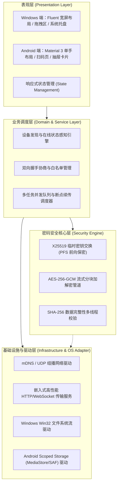

# 本科毕业设计（论文）开题报告

* **课题名称**：基于混合加密与零配置协议的跨平台安全快传系统设计与实现
* **英文名称**：Design and Implementation of a Cross-Platform Secure Fast-Transfer System Based on Hybrid Encryption and Zero-Configuration Protocol
* **专业方向**：网络空间安全 / 计算机科学与技术
* **课题性质**：工程设计 / 应用研究

---

## 一、 选题依据、背景及研究意义

### 1.1 研究背景
随着智能移动设备和个人 PC 的深度普及，用户在多终端间流转文档、图片、音视频及代码工程已成为日常高频刚需。然而，当前主流的文件传输方式面临着严重的**隐私安全威胁、跨生态兼容壁垒与传输性能瓶颈**：
1. **公网云盘与社交软件的数据隐私隐患**：微信、QQ、网盘等工具虽普及度高，但文件流转必须经由第三方商业云端中转，不仅面临被服务商审查、脱敏泄露及长期存储的合规风险，且在大文件传输时普遍遭遇严苛的人为带宽限速（通常限制在几十 KB/s 至几 MB/s）。
2. **商业生态的封闭性隔阂**：Apple AirDrop（隔空投送）、华为分享（Huawei Share）等近场传输技术虽体验良好，但均被厂商严格锁定在其私有硬件生态内，无法打破 Windows 桌面生态与 Android 移动生态之间的物理割裂。
3. **公共网络环境的通信安全隐患**：在大学校园网、开放式咖啡厅等局域网环境中，传统局域网共享（如未加密的 FTP、Samba 或 HTTP 明文互传）极易遭受 ARP 欺骗、网络嗅探（Sniffing）及中间人劫持（MITM），导致传输凭证或机密数据被窃取。

### 1.2 研究意义
* **实际应用价值**：本课题旨在构建一套“**零云端依赖（Zero-Cloud）、端到端加密（E2EE）、即开即传、跨生态兼容**”的轻态化局域网文件安全快传工具。充分发挥 Wi-Fi 6 / 千兆路由器的近场物理带宽（可达 50~100MB/s+），在保障数据物理级私密性的同时，实现 Windows 与 Android 设备间的极速安全传输。
* **工程与学术价值**：课题将网络空间安全技术与现代软件工程深度融合，探索了**在无集中式 CA 证书认证体系的弱信任局域网环境下，如何通过“带外信道（Out-of-Band Channel）+ 混合密码学体系”构建去中心化信任锚点**，并提出了高内聚低耦合的分层架构与流式加解密管道，对解决大文件内存溢出与跨平台异构系统适配具有显著参考价值。

---

## 二、 国内外研究现状与分析

### 2.1 商业专用闭环快传技术
以 Apple 的 AirDrop 为典型代表，其基于蓝牙 BLE 完成近场对等发现，并通过 Apple 专有协议自动握手 Wi-Fi Direct 点对点传输，体验极其流畅。但其弊端在于**协议闭源、强绑定苹果生态硬件**。华为、小米等厂商成立的“互传联盟”同样依赖定制 ROM 与无线网卡底层驱动，对 Windows PC 的支持薄弱且体验割裂。

### 2.2 开源与通用局域网传输工具
近年来涌现出以 LocalSend、Syncthing、Warpinator 为代表的开源传输工具。
* **Syncthing**：偏向于持续性多端文件夹同步，基于全局发现服务器与公网中继，架构庞大，配置门槛高，违背了普通用户“单次点对点临时快传”的使用心智。
* **LocalSend**：基于 Flutter 实现了多端局域网发现，但其采用标准自签名 HTTPS 证书体系，缺乏严密的**带外双向指纹防中间人（Anti-MITM）验证机制**，且面对国内高校普遍开启的**“AP 隔离（Client Isolation）”**场景缺乏主动穿透与单播逃生机制。

### 2.3 现有方案的局限性总结
综合分析，现有方案在**“安全防伪造”、“跨端一致体验”与“弱网络适应力”**三者之间存在失衡：要么为了体验牺牲安全性（明文或无验证广播传输），要么为了安全依赖中心化云端账户体系，且普遍缺乏针对 Windows 桌面原生拖拽交互与 Android 现代分区存储（Scoped Storage）沙箱规范的精细化深度适配。

---

## 三、 研究内容与拟解决的关键问题

### 3.1 主要研究内容
本课题围绕“安全、高效、轻量、解耦”四大目标，开展以下模块的研发：
1. **基于零配置网络（Zeroconf）的主机发现与动态拓扑呈现**：
   * 采用 mDNS（组播 DNS）实现局域网设备免配置自动寻址；
   * 设计动态心跳保活与设备下线检测机制，驱动雷达图与设备网格响应式刷新。
2. **端到端混合加密与动态会话协商协议设计**：
   * 采用 **X25519（ECDH）** 椭圆曲线算法，实现临时会话密钥的无感知协商，确保完全前向保密（PFS）；
   * 结合 **AES-256-GCM** 认证加密（AEAD），构建防窃听、防篡改、防重放的数据安全传输管道。
3. **弱网络穿透与带外身份核验机制（Anti-MITM）**：
   * 针对无 CA 局域网环境，设计“动态二维码扫描 / 6位安全 PIN 码”的带外信道比对方案，建立首次使用信任（TOFU）与白名单持久化机制；
   * 针对校园网 AP 隔离环境，设计“动态 IP+公钥单播直连通道”，实现对组播阻断环境的主动穿透。
4. **高性能分块流式传输与断点续传控制**：
   * 设计定长（1MB）滑动窗口分块传输机制，实现 GB 级超大文件“边读取、边加密、边传输、边解密、边落盘”的低内存占用流式调度；
   * 建立基于 SHA-256 的分块哈希校验与断点续传队列。
5. **Windows 桌面端与 Android 移动端差异化深度适配**：
   * **Windows 端**：设计 Fluent 现代轻态化交互界面，支持全局多文件/文件夹拖拽捕获、系统托盘后台常驻与 Action Center 原生通知；
   * **Android 端**：适配 Wi-Fi `MulticastLock` 组播唤醒锁、CameraX 快速扫码、Android 10+ 分区存储（Scoped Storage）沙箱落盘合规、以及系统级前台保活服务（Foreground Service）。

### 3.2 拟解决的关键技术问题
1. **无中心证书认证中心（CA）条件下的身份防伪与信任锚点建立**：
   * 如何在没有公网第三方数字证书颁发机构介入的前提下，证明局域网中声称的设备未被伪造，避免黑客发起 ARP 欺骗与公钥替换劫持。
2. **大文件高并发加密传输下的内存溢出（OOM）与系统卡顿**：
   * 如何避免将数 GB 的文件一次性读入内存进行加密计算，设计高效的异步背压（Backpressure）流式管道，将内存常驻压低在 50MB 以内。
3. **Android 系统的深度休眠、后台保活与网络组播拦截**：
   * 解决移动端熄屏或切到后台时，系统节电模式（Doze Mode）强杀 TCP 连接以及底层网卡默认过滤 UDP 组播报文的痛点。
4. **高校/企业专用网络的 AP 隔离与广播封锁穿透**：
   * 解决校园网阻断跨主机通信与组播发现的客观网络限制，设计无缝平滑降级的备用通信链路。

---

## 四、 研究方案与技术路线

### 4.1 系统整体架构解耦设计
系统严格遵循“整洁架构（Clean Architecture）”思想，划分为四大相互解耦的核心层次：

### 4.2 核心业务与安全传输流程
1. **发现与建联**：设备启动后，通过 mDNS 广播携带公钥指纹的身份宣告；若处于 AP 隔离网络，则由手机扫取 PC 端二维码获取网络坐标。
2. **带外核验**：首次互通时，双方在屏幕呈现动态随机 6 位 PIN 码并由用户确认，或通过扫码直接完成公钥指纹绑定，将对方公钥指纹录入本地 SQLite 白名单。
3. **会话协商**：发起传输前，双方基于 X25519 执行 Diffie-Hellman 握手，由 HKDF 派生 256 位临时 `SessionKey`。
4. **分块流转**：发送端将文件切为 1MB 分块，利用 `SessionKey` 执行 AES-256-GCM 封装（密文 + 16字节 Tag），通过 HTTP Chunked 管道推送；接收端实时解密校验，边解密边追加写入临时文件，全部完成后重命名转正。

### 4.3 关键技术选型及论证
* **开发主语言与框架**：选用 **Flutter (Dart)**。
  * *论证*：相比于 Electron 动辄 100MB+ 的安装包和高内存消耗，Flutter 通过原生 C++ 引擎编译为 Windows 原生可执行文件（.exe）和 Android 原生 APK；Dart 拥有原生异步流（Stream）特性，极度贴合分块网络 I/O 调度，且能实现 **双端核心业务逻辑与密码学代码 80% 以上的高比例复用**。
* **密码学算法选型**：
  * **密钥协商**：选用 **X25519 (Curve25519)**，计算开销极低、抗侧信道攻击，且公钥尺寸极小（32字节），便于嵌入二维码。
  * **对称加密**：选用 **AES-256-GCM**。相比传统的 CBC 模式，GCM 属于 AEAD（带有关联数据的认证加密），天生集成消息认证码（MAC），能一并防御密文篡改与重放攻击。

---

## 五、 预期成果与创新特色

### 5.1 预期交付成果
1. **软件工程制品**：
   * Windows 端单文件免安装绿色版图形化客户端（`SafeDrop-Windows.exe`）；
   * Android 手机端独立安装包（`SafeDrop-release.apk`）；
   * 规范解耦、注释完备的工程源代码仓库。
2. **测试与技术指标**：
   * 局域网传输速率跑满物理 Wi-Fi 限制，千兆环境下实测传输速度达到 **50MB/s ~ 90MB/s**；
   * 传输 5GB 以上超大文件时，双端内存占用始终控制在 **50MB 以内**，CPU 占用率低于 15%；
   * 验证通过针对局域网重放攻击与中间人伪造攻击的密码学有效拦截。
3. **学术成果**：符合高校学术规范的完整毕业设计论文（万字以上）与答辩 PPT。

### 5.2 课题特色与创新点
1. **零云端依赖的绝对隐私安全架构**：彻底摈弃中心化中转服务器，数据传输生命周期严格限制在物理局域网信道内，落实真正的“端到端零知识传输”。
2. **带外信道与多层防御机制深度融合**：针对无 CA 证书网络，创新性地将“二维码/PIN 码带外认证”作为信任锚点，并融合 AP 隔离穿透技术，兼顾了顶级安全性与弱网络适应力。
3. **跨平台整洁解耦与轻态化工程实践**：以统一的协议契约驱动双端开发，Windows 端融合现代 Fluent 设计与全局拖拽，Android 端严格遵循 Scoped Storage 沙箱合规，展示了优秀的现代软件工程跨端解耦设计。

---

## 六、 研究进度规划与里程碑

| 阶段划分 | 起止时间（建议周次） | 核心工作任务与技术交付物 | 检查标志 |
| :--- | :--- | :--- | :--- |
| **阶段一：开题与架构设计** | 第 1 ~ 2 周 | 深入调研国内外快传工具与密码学标准，确立通信协议契约，完成开题报告与架构分层评审。 | 开题报告通过、通信协议文档定稿 |
| **阶段二：双端工程基建** | 第 3 ~ 4 周 | 搭建 Windows 与 Android 原生开发环境，完成 Fluent 与 Material 3 基础 UI 搭建与动态权限适配。 | 双端静态界面运行正常 |
| **阶段三：通信与安全引擎** | 第 5 ~ 7 周 | 实现 mDNS 组播发现、X25519 密钥协商、AES-256-GCM 流式加解密管道及带外配对流程。 | 完成本地分块加密传输单元测试 |
| **阶段四：平台特性与优化** | 第 8 ~ 9 周 | Windows 端接入全局拖拽与托盘服务；Android 端适配 MulticastLock、前台保活与相册无缝落盘；调试断点续传。 | 实现跨端 5GB 大文件稳定互传 |
| **阶段五：联调测试与压测** | 第 10 ~ 11 周 | 开展千兆 Wi-Fi / 校园网 AP 隔离 / 热点等极限网络测试，收集传输速率与内存功耗数据，优化缺陷。 | 形成系统测试与性能分析报告 |
| **阶段六：论文撰写与答辩** | 第 12 ~ 14 周 | 整理系统架构图与实测数据，撰写毕业设计论文正文，制作答辩 PPT，准备终期答辩。 | 提交毕业论文初稿与可执行程序 |

---

## 七、 主要参考文献

[1] RFC 6762. Multicast DNS[S]. IETF, 2013.  
[2] RFC 6763. DNS-Based Service Discovery[S]. IETF, 2013.  
[3] RFC 7748. Elliptic Curves for Security: Curve25519 and Curve448[S]. IETF, 2016.  
[4] RFC 5116. An Interface and Algorithms for Authenticated Encryption[S]. IETF, 2008.  
[5] RFC 5869. HMAC-based Extract-and-Expand Key Derivation Function (HKDF)[S]. IETF, 2010.  
[6] Dworkin M. Recommendation for Block Cipher Modes of Operation: Galois/Counter Mode (GCM) and GMAC[R]. NIST Special Publication 800-38D, 2007.  
[7] Martin R C. Clean Architecture: A Craftsman's Guide to Software Structure and Design[M]. Prentice Hall, 2017.  
[8] Google Developers. Android Storage Use Cases and Best Practices (Scoped Storage)[EB/OL]. https://developer.android.com, 2024.  
[9] Microsoft Corporation. Windows App Development: Fluent Design System Guidelines[EB/OL]. https://learn.microsoft.com, 2024.  
[10] Stallings W. Cryptography and Network Security: Principles and Practice (7th Edition)[M]. Pearson, 2017.
